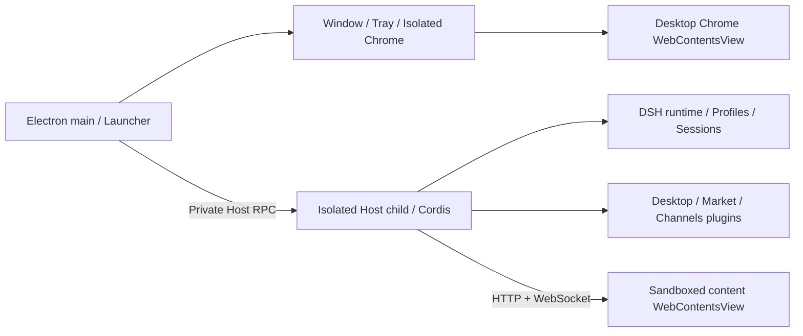

# ClawClaw architecture

[中文](architecture.md)

This page describes current source. Dated Agent Notes record historical decisions rather than superseding current interfaces.

## Processes and ownership

ClawClaw defaults to `startIsolatedDesktopHost()`. `DSH_DESKTOP_ISOLATED_HOST=0` retains an in-process diagnostic path. Electron main owns native resources; Host owns Cordis, plugins, the Web service, and sessions. Private Host RPC is not a public Electron interface. Browser plugins use standard Web routes, RPC, services, and slots.

Startup resolves data paths, profile, package environment, and preferences, then runs Setup Wizard when required. Host boot and Web/client health precede healthy checkpoints. Profile, presentation, and material changes dispose the current generation and restart. Service references and process handles must not cross generations.

## UI ownership

On macOS/Windows, compatibility and extended modes use two independent WebContentsViews in one native window. Desktop Chrome owns the 36-pixel toolbar; content is sized below it. Plugin styles and portals cannot cross this document boundary. Content-side `desktopWindow.safeAreaInsets` and `dragRegion` are zero; do not reserve another 36 pixels. Linux compatibility uses native-titlebar fallback.

Compatibility preserves upstream layout; extended composes Desktop layout/sidebar; advanced has its own root and integrated captions. Desktop separately owns confirmation, recovery, and setup windows. See [chrome isolation](../dsh-plugin-desktop/docs/compatibility-chrome-isolation.md) and the [service contract](../dsh-plugin-desktop/docs/plugin-services.md).

## Workspaces, data, and models

Default Harness home is `~/.clawclaw/data`; the default workspace is `~/.clawclaw/workspaces/default`. See the [user guide](user-guide.en.md) for migration, overrides, and channel sharing. The default workspace is registered through the upstream registry and protected against deletion in Host. Client persists active selection and supplies a bilingual directory flow. A workspace is neither a profile nor a recovery checkpoint.

The Desktop patch composes `spiritx` by default using the upstream pi-ai transport with OpenAI Responses at `https://ai.xzinfra.com/spiritx-api/v1`. Credentials use `SPIRITX_API_KEY`; the default model is `DeepSeek-V4-Flash`. The declared catalog is in `cordis.patch.yml` and does not guarantee server availability. The default composition disables the original DeepSeek model adapter, its API extensions, session log reporting, official package inventory, session telemetry, and DeepSeek web search; HTTP fetch remains available. User profiles may explicitly change composition.

`@clawclaw/dsh-im` supplies Channels, built on pinned `@xmanrui/dsh-im` 4.20.2. Product channel UI, directory selection, and session patches are maintained separately from the supplier runtime.

## Packages and provenance

| Path | Responsibility |
| --- | --- |
| `dsh-plugin-desktop/` | ClawClaw Host/Client, Electron, packaging, and tests |
| `channels/dsh-im/` | Channels composition, UI, build patches, tests |
| `dsh-community-fabric/` | Private RFC documentation; no runtime or published SDK |
| `deepseek-harness/` | Pinned read-only upstream submodule with independent pnpm workspace |
| `vendor/dsh-runtime/` | Pinned runtime tarballs and manifests |
| `patches/` | Explicit dependency patches applied by outer pnpm |

The outer workspace uses pnpm 11.8.0 with the isolated linker. ClawClaw pins the DSH 0.1.7-rc.2 source/runtime family; `upstream.json` records the single pin and the gitlink matches it. Root overrides select vendored tarballs, with compatibility fixes in `patchedDependencies`. Applications do not source-link the upstream checkout.

## Services and recovery

Public Host contracts are `desktopProfiles` and `desktopPnpm`; Client exposes `desktopWindow`. `desktopPnpm` offers `run`, `runPlugin`, and `runExternalMarketPluginInstall`, without `installPlugin()` or installation WAL/receipt transactions. Market uses `run()` and owns npm target selection and bundle reconciliation.

Healthy startup rotates three configuration checkpoints. Recovery requires an explicit slot selection; startup never silently returns to an old profile. Checkpoints exclude sessions, credentials, and workspace files. Renderer watchdog/reload recovery repairs presentation, not data or the entire Host.

## Packaging and updates

The Desktop package disables ASAR on all platforms. Root manifest, `lib`, and dependencies are physical files under `resources/app/` (`Contents/Resources/app/` on macOS). Runtime-closure gates cover Host, CLI, pnpm, native dependencies, and profile fallback.

The package is `dsh-plugin-desktop`, the product is ClawClaw, and its appId is `com.clawclaw.desktop`.

Updates read `https://clawclaw.xzinfra.com/updates/stable/release.json`. Manifests require the `stable` channel, a canonical version, and `darwin`/`win32` artifacts with HTTPS `url`, base64 `sha512`, and `size`. Manifest bodies are capped at 16 KiB, installers at 1 GiB. Manifest and artifact requests reject redirects and omit original-project statistics headers. Downloads verify SHA-512 and container format. There is no independent manifest digital-signature verification; a digest check must not be described as signature verification.

See [package reference](../dsh-plugin-desktop/README.md) for release commands. This describes the client protocol, not proof that the remote service or artifacts are deployed.
