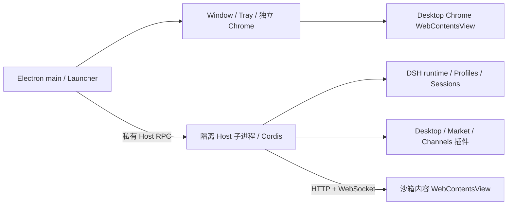

# ClawClaw 架构

[English](architecture.en.md)

本文描述当前源码。日期化 Agent Notes 记录当时的设计取舍，不能替代本页或当前接口。

## 进程与运行边界

ClawClaw 默认通过 `startIsolatedDesktopHost()` 启动 Host；`DSH_DESKTOP_ISOLATED_HOST=0` 保留同进程排查路径。Electron main 拥有原生资源，Host 拥有 Cordis、插件、Web 服务和会话。Host 与 main 之间是内部 RPC，第三方插件不能把它当作公开 Electron 接口。浏览器插件仍通过标准 Web routes、RPC、service 和 slot 通信。

启动先确定数据目录、profile、包解析环境和偏好；未初始化时先运行 Setup Wizard。然后启动 Host，等待 Web 与客户端健康状态，显示内容并记录健康检查点。切换 profile、窗口模式或材质会释放当前 generation 并重启；服务引用和进程 handle 不跨 generation 缓存。

## UI 所有权

macOS/Windows 的兼容和扩展模式在一个原生窗口内使用两个独立 WebContentsView。Desktop Chrome 拥有 36 像素工具栏，内容 View 位于其下方；样式、portal 和第三方客户端不能跨文档影响 Chrome。因此内容侧 `desktopWindow.safeAreaInsets` 与 `dragRegion` 为零，不能再次预留 36 像素。Linux 兼容模式使用原生标题栏回退。

兼容模式保留上游默认布局；扩展模式组合 Desktop layout/sidebar；增强模式使用自己的 root 和集成 caption。确认、恢复和 Setup 等工具窗口由 Desktop 独立管理。详见[标题栏隔离](../dsh-plugin-desktop/docs/compatibility-chrome-isolation.md)与[服务合同](../dsh-plugin-desktop/docs/plugin-services.zh.md)。

DSH 0.1.7-rc.2 的 `sidebar.panellist` 是一级产品入口的唯一扩展点。Desktop 复用上游插件管理器的主面板实现并接管其侧栏入口，通过 `dshmarket` 的 `market` 服务把市场页面嵌入其中，同时隐藏旧 Settings 市场入口。自动化主面板由 `desktop-cron-tasks` 提供；上游 `schedule`/`ui-schedule` 在 Desktop Profile 中禁用，直到存在无损、可回滚的数据迁移协议。旧 `sidebar.shortcuts` 已退役；可配置快捷菜单统一投影插件、自动化任务和 Settings section：已有主面板直接注册侧栏入口，Settings 项动态注册 `sidebar.panellist` / `main` 转接入口并通过 Settings root store 定向打开 section。运行时不再按翻译文本修改 Settings DOM。

## 工作区、数据与模型

默认 Harness home 是 `~/.clawclaw/data`，默认工作区是 `~/.clawclaw/workspaces/default`。迁移、覆盖和通道共享规则见[用户指南](user-guide.md)。默认工作区通过上游 registry 注册，Host 阻止删除该注册；Client 持久化活动选择并提供中英文目录流程。工作区不是 profile，也不是恢复检查点。

Desktop patch 默认组合 `spiritx`，通过上游 pi-ai transport 的 OpenAI Responses 协议访问 `https://ai.xzinfra.com/spiritx-api/v1`，凭据环境变量为 `SPIRITX_API_KEY`，默认模型为 `DeepSeek-V4-Flash`。支持目录以 `cordis.patch.yml` 为准，不代表服务端每个模型都可用。默认禁用原 DeepSeek 模型适配器、其 API extensions、session 日志上报、官方 package inventory、session telemetry 和 DeepSeek web search；HTTP fetch 保持可用。用户 profile 可以显式改变组合。

Channels 由 `@clawclaw/dsh-im` 提供，基于固定的 `@xmanrui/dsh-im` 4.20.2 构建。桌面自有渠道页面、目录选择和会话修补与供应方运行时代码分开维护。

## 包与来源

| 路径 | 职责 |
| --- | --- |
| `dsh-plugin-desktop/` | ClawClaw 产品、Host/Client、Electron、打包与测试 |
| `channels/dsh-im/` | Channels Host 组合、UI、构建修补与测试 |
| `dsh-community-fabric/` | 私有 RFC 文档工程；无运行时或发布 SDK |
| `deepseek-harness/` | 固定的只读上游子模块，独立 pnpm workspace |
| `vendor/dsh-runtime/` | 固定运行时 tarball 和 manifest |
| `patches/` | 外层 pnpm 对依赖应用的显式补丁 |

外层使用 pnpm 11.8.0 的 isolated linker。ClawClaw 固定 DSH 0.1.7-rc.2 source/runtime family；`upstream.json` 记录唯一 pin，gitlink 与之对应。根 workspace override 指向 vendored tarball，`patchedDependencies` 应用兼容修补。应用不直接链接上游源码树。

## 服务和恢复

公开 Host contract 是 `desktopProfiles` 与 `desktopPnpm`；Client contract 是 `desktopWindow`。`desktopPnpm` 提供 `run`、`runPlugin`、`runExternalMarketPluginInstall`，不再提供 `installPlugin()` 或安装 WAL/receipt 事务。Market 使用 `run()`，自己管理 npm 目标与 bundle reconcile。

每次健康启动轮换三个配置检查点；失败后由用户选择恢复槽位，启动不会自动切回旧 profile。它们不包含 session、凭据或 workspace 文件。Renderer watchdog 和崩溃重载修复界面，不等同于回滚数据或重启整个 Host。

## 打包与更新

Desktop 包在所有平台均禁用 ASAR。应用主 manifest、`lib` 和依赖以物理文件放在 `resources/app/`（macOS 为 `Contents/Resources/app/`）。运行时闭包检查覆盖 Host、CLI、pnpm、native 依赖及 profile fallback。

包名为 `dsh-plugin-desktop`，产品名为 ClawClaw，appId 为 `com.clawclaw.desktop`。

更新读取 `https://clawclaw.xzinfra.com/updates/dsh/stable/release.json`。manifest 必须提供 `stable` channel、规范版本和 `darwin`/`win32` 的 HTTPS `url`、base64 `sha512`、`size`；正文最多 16 KiB，安装包最多 1 GiB。版本与下载请求均拒绝重定向，不发送原项目的统计 header。下载校验 SHA-512 与容器格式；实现不验证 manifest 的独立数字签名，不能将摘要校验描述为签名验证。

发布步骤见[包级参考](../dsh-plugin-desktop/README.zh.md)。本页描述客户端协议，不证明远程端点或发行产物已经上线。
